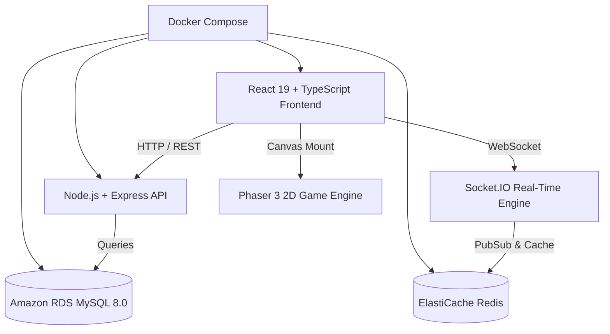

# 🎮 BATTLEVERSE — 3V3 HERO ARENA

<div align="center">


**ENTER THE BATTLE • 3V3 HERO ARENA**

[]()
[]()
[]()
[]()
[]()
[]()
[]()
[]()

*An original, high-octane 3v3 multiplayer cartoon hero-arena game platform built with React 19, TypeScript, Phaser 3, Node.js/Express, MySQL, Socket.IO, Docker, and AWS.*

</div>

---

## 🌟 Overview

**BATTLEVERSE** is a competitive multiplayer gaming web platform featuring **100% original heroes, abilities, and game modes**. Built from the ground up to deliver a console/mobile-grade gaming dashboard and playable 2D top-down arena.

---

## 🦸 Original Hero Lineup

| Hero | Class | Rarity | Ability | Super Ability | Passive |
| :--- | :--- | :--- | :--- | :--- | :--- |
| **🔥 BLAZE** | Damage | Legendary | Flame Shot | **Fire Storm** | *Hot Blood* (+25% speed under 40% HP) |
| **⚡ VOLT** | Assassin | Epic | Thunder Strike | **Lightning Dash** | *Static Charge* (Every 3rd hit shocks) |
| **🛡️ TITAN** | Tank | Epic | Hammer Smash | **Shield Wall** | *Iron Skin* (-15% damage taken) |
| **❄️ FROST** | Controller | Super Rare | Ice Shards | **Ice Burst** | *Frost Trail* (Allies gain speed) |
| **🚀 ROCKET** | Damage | Super Rare | Missile Burst | **Rocket Barrage** | *Afterburner* (Post-super speed burst) |
| **🌙 LUNA** | Support | Rare | Star Beam | **Healing Pulse** | *Moonlight Aura* (Team health regen) |
| **👊 BUSTER** | Tank | Rare | Power Punch | **Ground Slam** | *Thick Hide* (CC knockback immunity) |
| **🤖 PICO** | Support | Rare | Drone Zap | **Energy Boost** | *Quick Charge* (+25% super charge rate) |

---

## 🏗️ Architecture & Technology Stack



- **Frontend**: React 19, TypeScript, Vite, Tailwind CSS v4, Framer Motion, Lucide Icons, Web Audio API Sound Engine.
- **Game Engine**: Phaser 3 (2D Top-Down Crystal Clash Arena, WASD + Mouse Aim & Mobile Touch Controls).
- **Backend**: Node.js, Express, TypeScript, JWT, bcryptjs, Helmet, CORS, Rate-Limiting.
- **Real-Time Multiplayer**: Socket.IO with Room Matchmaking & State Sync.
- **Database**: MySQL 8.0 (15 Normalized Tables with Seed Data).
- **Containerization**: Multi-stage Dockerfiles & Docker Compose.
- **DevSecOps**: GitHub Actions CI/CD, SonarQube Code Quality Analysis, Trivy Security Scanner.
- **Infrastructure as Code**: Terraform for AWS (VPC, ECS Fargate, ALB, RDS MySQL, Redis, CloudFront).
- **Monitoring**: Prometheus, Grafana Dashboards, Loki, Promtail.

---

## 🕹️ Game Features & Routes

- **`/` (Home)**: Cinematic gaming landing page with animated hero banner, why section, featured heroes, and quick matchmaking CTA.
- **`/heroes` & `/heroes/:id`**: Interactive hero roster with class/rarity filters, animated stat bars, and detailed ability showcases.
- **`/modes`**: Game mode selection (*Crystal Clash 3v3*, *Showdown*, *Ranked Arena*, *Custom Games*).
- **`/lobby` / `/play`**: 3v3 team lobby with hero selector, matchmaking state machine, and player readiness toggles.
- **`/arena` / `/game`**: **Playable Phaser 3 2D Arena** — WASD movement, mouse shooting, AI bot combat, 10-crystal victory countdown, and post-match rewards screen (+25 trophies, +500 XP, +250 coins).
- **`/profile`**: Player stats dashboard with Level/XP progression, weekly match win/loss analytics, 6-axis performance radar, and achievement badges.
- **`/ranking`**: Global, local, and friends leaderboard with rank tier badges (*Diamond I*, *Master*, *Legend*).
- **`/shop`**: In-game skin & resource shop with virtual purchase simulations.
- **`/friends`**: Live friend status (*Online*, *In-Game*, *Offline*), party invites, and referral code sharing.
- **`/events`**: Limited-time events with live countdown clocks and multiplier rewards.
- **`/settings`**: Audio sliders, desktop/mobile control toggles, and keybindings.
- **`/login` & `/register`**: Gaming authentication with instant 1-click demo login.

---

## 🚀 Quick Start

### 1. Prerequisites
- Node.js 20+ (Node.js 22 recommended)
- npm or pnpm

### 2. Installation & Local Development
```bash
# Clone the repository
git clone https://github.com/ajithkumar31082004-bit/Brawl_star.git
cd Brawl_star

# Install dependencies
npm install

# Start Vite development server
npm run dev
```

Open your browser at **`http://localhost:5173`**

### 3. Production Build
```bash
npm run build
```

---

## 🐳 Docker Orchestration

Run the complete multi-tier stack (Frontend, Backend, MySQL, Redis):

```bash
docker compose up --build
```

- **Frontend**: `http://localhost:80`
- **Backend API**: `http://localhost:5000/api`
- **MySQL**: `localhost:3306`
- **Redis**: `localhost:6379`

---

## ☁️ Terraform AWS Deployment

```bash
cd terraform
terraform init
terraform plan
terraform apply
```

Deploys:
1. Multi-AZ VPC with Public and Private Subnets across 2 Availability Zones.
2. Application Load Balancer with HTTPS listeners.
3. ECS Fargate Cluster with container auto-scaling.
4. Amazon RDS MySQL 8.0 Multi-AZ database.
5. Amazon ElastiCache Redis replication group.

---

## 📄 License & Attribution

All heroes, graphics, names, arena mechanics, and branding are **100% original creations**. No copyrighted assets from Supercell or Brawl Stars are used.
Released under the MIT License.
